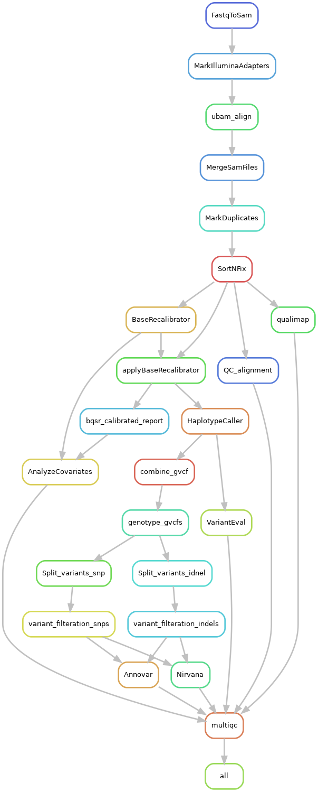

## THIS WORKFLOW IS STILL UNDER DEVELOPMENT AND IS NOT READY YET!

## Introduction

**Note: This workflow is still under development.**

WES GATK is a flexible and user-friendly whole exome sequencing workflow based on [GATK best practices](https://gatk.broadinstitute.org/hc/en-us/sections/360007226651-Best-Practices-Workflows). It is designed for processing Illumina WES short reads data and features automatic sample table generation, Snakemake configuration file, and simplified workflow execution.

## Workflow
### Description:
The workflow starts by converting `raw fastq` file to an `unmapped bam` file to include the read group information. Then, Illumina adaptors are marked and reads are aligned to hg38 reference human genome using BWA and consdier the alternative haplotype mapping. Multiple `BAM` files of the same sample are merged then PCR and optical duplicates are marked and reads are sorted by genome coordinates. Sorted BAM files are analayzied to generate mapping QC metrics. The following steps include the Base Quality score recalibration calculation using known variants files and GATK's Machine learning algorithm to recalibrate the quality scores and apply these new qualities to the `BAM` file. We now can call the variants using GATK's "haplotypecaller" in `GVCF` format, and combine all samples in a single `gvcf` file. The merged file is used for a final joint variant calling step to produce a single `vcf` file the include the genotypes of all samples. For better annotation, the file is splitted into two files, one for indels, and the other for snps. The last steps are variant filtration and variant annotation using Nirvana and Annovar. 

### Features:
This workflow is an implemetation of the Gold Standard GATK best practice in addition to these features:
- Exome implementation ( uses user provided intervals file for specefic location calling + X basepair padding (default = 100pb) [see below](###-Advanced-Parameters) )
- 
- Joint Gentotyping for all samples 
- Automatic sample name, group, lane and read number recognition.
- Automatic snakemake sample table and config file generation.
### Workflow Diagram:


## Quick Start

### Installation

Clone the repository:
```
git clone https://github.com/AbdelrahmanYahia/wes_gatk.git
```


If you prefer to download the dependencies manually, you can find them [here].

### Step-by-Step Installation Guide

#### Register ANNOVAR

To obtain the link, you need to register at [Annovar website](https://www.openbioinformatics.org/annovar/annovar_download_form.php).

Make sure you have Conda and Mamba installed. If not, follow these steps:
```
wget https://repo.anaconda.com/miniconda/Miniconda3-latest-Linux-x86_64.sh
bash Miniconda3-latest-Linux-x86_64.sh # Follow the prompts
```


Install Mamba:
```
conda install mamba -n base -c conda-forge

```

Restart your terminal.

#### Prepare the Environment

Change the permissions for the `Prep_ENV.sh` file:
```
chmod 777 wes_gatk/scripts/Prep_ENV.sh
```


Create the environment, install the tools, and download the annotations database:
```
./wes_gatk/scripts/Prep_ENV.sh $ANNOVAR_LINK
```


This process may take some time.

You can also download all the required reference files using `wes_gatk/scripts/gatk_download_data.sh`:
```
chmod 777 wes_gatk/scripts/gatk_download_data.sh
bash wes_gatk/scripts/gatk_download_data.sh $DOWNLOAD_DIR
```


### Running the Analysis

To start the analysis, activate the `wes_gatk` environment and run the `wes.py` file:
```
conda activate wes_gatk
cd wes_gatk
python3 wes.py WES --help
```

You can also use the Python file to generate the sample table and the config file, and then run Snakemake independently. Modify the parameters according to your needs:
```
conda activate wes_gatk
python3 wes.py WES \
  --input PTH/to/samples \
  --output PTH/to/outdir \
  --reference-fasta broad_hg38/Homo_sapiens_assembly38.fasta \
  --bed-file exome_bed/S07604715_Padded.bed \
  --gff-file broad_hg38/Homo_sapiens.GRCh38.109.gff3.gz \
  --nirvana-path ~/Nirvana \
  --annovar-path ~/annovar_source/annovar \
  --known-variants broad_hg38/1000G_omni2.5.hg38.vcf.gz \
  --reference-index broad_hg38/Homo_sapiens_assembly38.fasta \
  --generate-confs-only
```

As an alternative, you can edit the options in "prep_files.sh", then run it:
```
conda activate wes_gatk
bash prep_files.sh
```

To run a Snakemake dry-run:
```
conda activate wes_gatk
snakemake \
  --snakefile workflow/Snakefile \
  --configfile PTH/to/outdir/config.yml \
  -n -j THREADS
```
### Advanced Parameters

For advanced usage, you can refer to the following command-line options:
usage: Basic Run Usage example:
    guap WES -i indir -o outdir --bed-file file --reference-fasta fasta.fasta --reference-index indexpath 
        
```
optional arguments:
  -h, --help            show this help message and exit

basic config:
  -i in path, --input in path
                        Input directory path
  -o out path, --output out path
                        Output directory path

Workflow configure:
  --threads N           Number of total threads to use [default = all]
  --reference-fasta path/to/file.fa
                        path to reference fasta file
  --bed-file path       bed file path
  --gff-file path       gff file path
  --nirvana-path path   Path for Nirvana
  --annovar-path path   Path for annovar
  --generate-confs-only
                        Generate sample table and config file only

QC configuration:
  --trimmomatic         Use trimmomatic
  --trim-t N            Number of threads to use during trim step
  --trim-min-length N   trimmomatic min length [default = 30]
  --slidingwindow-size N
                        trimmomatic sliding window size [default = 4]
  --slidingwindow-quality N
                        trimmomatic sliding window quality score [default = 10]
  --trimmomatic-extra-args ='-args'
                        A string value of extra args for trimmomatic (must be used with = with no spaces (--trimmomatic-extra-args='-arg1 -arg2'))
  --skip-QC             Skipp Fastqc step

Aligner configuration:
  --aligner-extra-args '-args'
                        Extra arguments for aligner, use it with no spaces and add = ( --aligner-extra-args='-arg1 -arg2' )
  --reference-index path/to/ref
                        path to reference index
  --reference-output-path path/to/ref
                        path to reference index
  --reference-output-prefix path/to/ref
                        path to reference index
  --index-fasta         Index fasta file

Variant caller configuration:
  --padding N           Interval padding to include
  --known-variants-indels path
                        path to reference fasta file
  --known-variants-indels2 path
                        path to reference fasta file
  --known-variants-snps path
                        path to reference fasta file
  --caller-extra-args '-args'
                        Extra arguments for caller, use it with no spaces and add = ( --caller-extra-args='-arg1 -arg2' )

Snakemake Options:
  --dry-run             performs snakemake dry run
  --export-dag          performs snakemake dry run and exports DAG
  --smk-extra-args ='-args'
                        A string value of extra args for snakemake(must be used with = with no spaces (--smk-extra-args='-arg1 -arg2'))
  --parse-snakemake-output
                        prints progress bar instead of snakemake regular output

Annotation configuration:
  --annovar-protocol str
                        Annovar Protocol defaults: refGene,avsnp150,clinvar_20221231,cosmic70,dbnsfp31a_interpro,EAS.sites.2015_08,EUR.sites.2015_08,gme,gnomad211_exome,SAS.sites.2015_08
  --annovar-operation str
                        Annovar Protocol defaults: g,f,f,f,f,f,f,f,f,f
  --annovar-extra-args ='-args'
                        A string value of extra args for annovar(must be used with = with no spaces (--annovar-extra-args='-arg1 -arg2'))
  --nirvana-extra-args ='-args'
                        A string value of extra args for nirvana(must be used with = with no spaces (--nirvana-extra-args='-arg1 -arg2'))

Other:
  --continue            continue analysis when re-run
  --overwrite           overwrite output dir if exsits
  -n str, --name str    Name of files [ default = guap_run[date time] ]
  --verbose             verbose
  --quit                print many output

```
